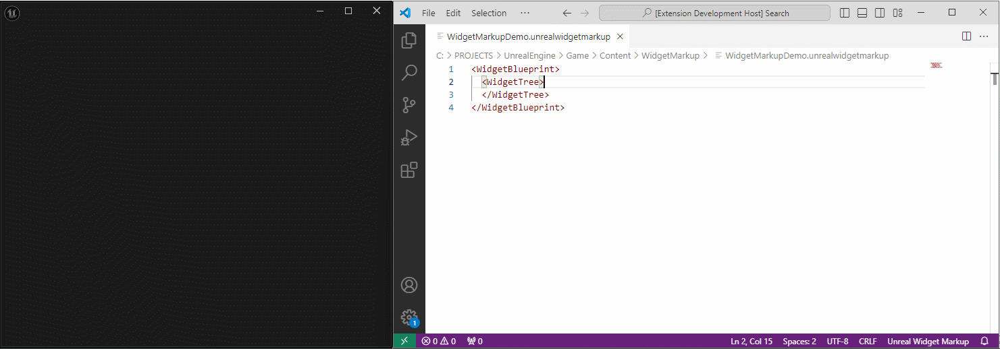
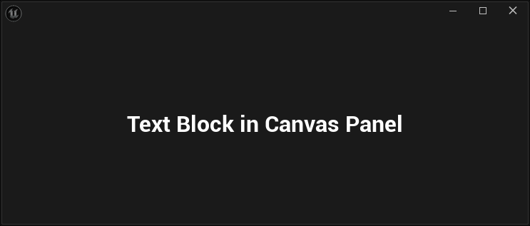
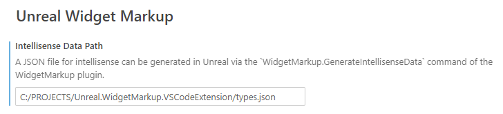
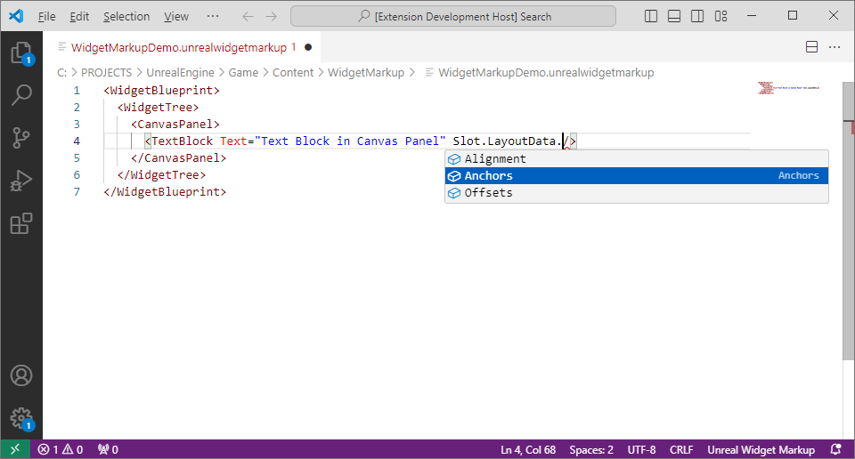

# WidgetMarkup

[English](README.md) | **简体中文**

在Unreal引擎中利用XML语言搭建UMG控件树。



## 快速开始

1. 在 Unreal 编辑器中启用 WidgetMarkup 插件。
2. 在项目内容源中准备一个 `*.unrealwidgetmarkup` 文件。
3. 在编辑器 CMD 输入栏执行：

```txt
WidgetMarkup.Show /Game/WidgetMarkup/Example
```

4. 预览窗口会打开，并在源文件变化时自动刷新。

## 用法

在Unreal引擎编辑器的CMD输入栏中输入：

```txt
WidgetMarkup.Show <包路径>
```

`包路径`需要使用 Unreal 资源路径格式，例如：

```txt
/Game/WidgetMarkup/Example
```

它对应同一路径下的 `Example.unrealwidgetmarkup` 源文件。

不要传入磁盘文件路径，也不要带 `.unrealwidgetmarkup` 扩展名。

文件内容如下：

```xml
<WidgetBlueprint>
  <WidgetTree>
    <CanvasPanel>
      <TextBlock Text="Text Block in Canvas Panel" Slot.LayoutData.Anchors.Minimum="0.5,0.5" Slot.LayoutData.Anchors.Maximum="0.5,0.5" Slot.bAutoSize="True" Slot.LayoutData.Alignment="0.5,0.5" />
    </CanvasPanel>
  </WidgetTree>
</WidgetBlueprint>
```

将会打开一个实时预览对应界面内容的窗口：



## 语法插件

本项目同时开发了[VSCode插件](https://github.com/9087/Unreal.WidgetMarkup.VSC)，支持简单的语法检查和智能提示。


使用插件前需要在引擎编辑器的CMD输入栏中输入：

```
WidgetMarkup.GenerateIntellisenseData <智能补全数据文件路径>
```

并将`智能补全数据文件路径`配置到插件设置中：



使用VSCode打开*.unrealwidgetmarkup文件即可生效：

